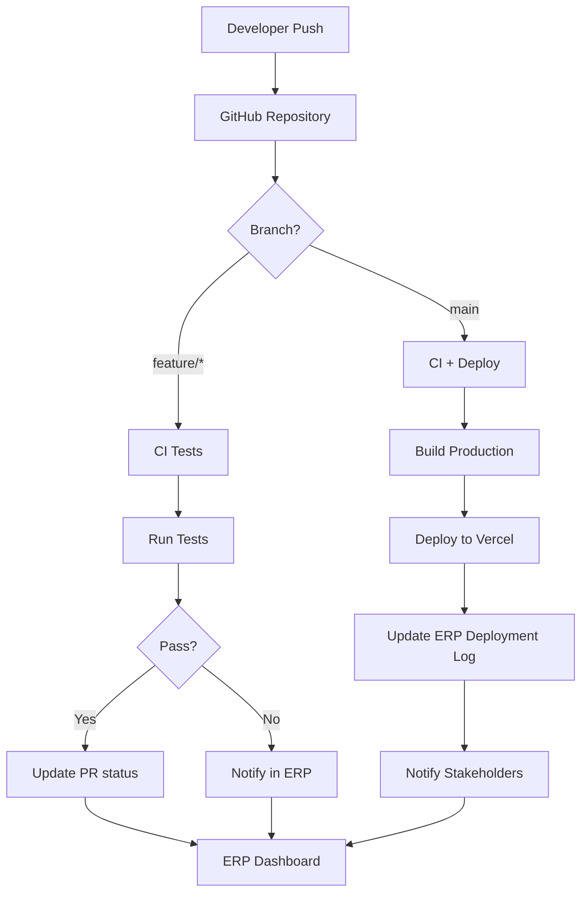

# 🔌 Solar GitHub Connector — Интеграция с GitHub

**Проект:** `Solarpaletten/solar-erp-nextjs`  
**Модуль:** GitHub Integration Layer  
**Дата:** 2025-11-03  
**Автор:** Claude (AI Engineer)  
**Статус:** 📋 Спецификация (Phase 2 - Planning)

---

## 🎯 1. Цель GitHub Connector в Solar ERP

### Основная миссия
**GitHub Connector** — это модуль интеграции Solar ERP с экосистемой GitHub, обеспечивающий:

- 🔄 **Автоматизацию CI/CD** — непрерывная интеграция и доставка кода
- 📊 **Синхронизацию задач** — связь GitHub Issues с ERP-системой
- 🚀 **Управление релизами** — отслеживание версий продуктов
- 📈 **Аналитика разработки** — метрики команды и кодовой базы
- 🤖 **AI-assisted development** — интеграция с Claude для code review

### Стратегические цели

#### Для команды разработки:
- ✅ Единая точка управления — из ERP в GitHub и обратно
- ✅ Автоматический деплой на production из `main` ветки
- ✅ Отслеживание прогресса фич в реальном времени
- ✅ Code quality metrics в дашборде компании

#### Для бизнеса:
- 📊 Прозрачность разработки для менеджмента
- ⏱️ Time-to-market метрики
- 💰 Cost tracking по фичам
- 🎯 Планирование спринтов из ERP

#### Для интеграции AI | IT | Solar:
- 🧠 AI-анализ кода через Claude API
- 🔗 Связь логистики → код → production
- 📝 Автогенерация технической документации
- 🔍 Трейсинг от бизнес-требований до коммитов

---

## 🔄 2. Поток данных (Push/Pull, CI/CD, Issue-Sync)

### 2.1 Push Flow — Solar ERP → GitHub

```
ERP Dashboard → GitHub API → Repository
```

**Сценарии:**

#### A. Создание задачи из ERP
```typescript
// User action: Create task in ITSolar Dashboard
POST /api/itsolar/tasks

↓

// Solar Connector creates GitHub Issue
POST https://api.github.com/repos/Solarpaletten/solar-erp-nextjs/issues
{
  "title": "[ITSolar] Add client export feature",
  "body": "**Company:** ACME Solar Ltd\n**Priority:** High\n...",
  "labels": ["itsolar", "feature", "high-priority"],
  "assignees": ["developer1"]
}

↓

// Issue #123 created
// ERP stores: github_issue_id: 123
```

#### B. Обновление статуса задачи
```typescript
// User marks task as "In Progress" in ERP
PATCH /api/itsolar/tasks/456/status

↓

// Update GitHub Issue
PATCH https://api.github.com/repos/.../issues/123
{
  "state": "open",
  "labels": ["itsolar", "in-progress"]
}

↓

// Add comment with ERP link
POST .../issues/123/comments
{
  "body": "Status updated to In Progress in Solar ERP\n[View in ERP](https://erp.solar/task/456)"
}
```

#### C. Триггер деплоя из ERP
```typescript
// Admin clicks "Deploy to Production" in ERP
POST /api/itsolar/deploy

↓

// Create GitHub Deployment
POST .../deployments
{
  "ref": "main",
  "environment": "production",
  "description": "Deployed from Solar ERP by admin@solar.com"
}

↓

// GitHub Actions triggered → Deploy
```

---

### 2.2 Pull Flow — GitHub → Solar ERP

```
GitHub Webhook → Solar API → ERP Database → Dashboard Update
```

**Сценарии:**

#### A. Новый коммит в main
```yaml
# GitHub → Webhook
Event: push
Ref: refs/heads/main
Commit: abc123 "feat: added ITSolar client export"

↓

POST https://erp.solar/api/webhooks/github
Headers:
  X-GitHub-Event: push
  X-Hub-Signature: sha256=...
Body: {...}

↓

# Solar Connector processes:
1. Parse commit message
2. Extract issue references (#123)
3. Update task status in ERP
4. Notify assigned users
5. Update company dashboard metrics

↓

# ERP Database updated
Task #456: status = "Deployed to Production"
           deployed_at = "2025-11-03T10:30:00Z"
           github_commit = "abc123"
```

#### B. Pull Request события
```yaml
# GitHub PR Events: opened, synchronize, closed, merged

Event: pull_request.opened
PR #45: "feat(itsolar): client search optimization"

↓

# Solar Connector:
1. Create ERP Code Review task
2. Assign to tech lead
3. Extract affected companies (from PR labels)
4. Add PR link to company dashboard

↓

# Dashboard shows:
"🔍 Code Review: Client Search Optimization (#45)"
Status: Awaiting Review
Estimated Impact: ACME Solar, BrightSun GmbH
```

#### C. Issue синхронизация
```yaml
# GitHub Issue → ERP Task (bidirectional)

GitHub Issue #67 created/updated
↓
Webhook → Solar Connector
↓
Check: Does ERP task exist?
  YES → Update ERP task
  NO → Create new ERP task (if labeled "itsolar")

↓
ERP Dashboard updated in real-time
```

---

### 2.3 CI/CD Pipeline Integration



**CI/CD Flow в коде:**

#### `.github/workflows/ci.yml`
```yaml
name: Solar ERP CI/CD

on:
  push:
    branches: [main, feature/*]
  pull_request:
    types: [opened, synchronize]

jobs:
  test:
    runs-on: ubuntu-latest
    steps:
      - uses: actions/checkout@v3
      - uses: pnpm/action-setup@v2
      
      - name: Install dependencies
        run: pnpm install
      
      - name: Run tests
        run: pnpm test
      
      - name: Build
        run: pnpm build
      
      - name: Notify Solar ERP
        if: always()
        run: |
          curl -X POST https://erp.solar/api/webhooks/github-ci \
            -H "Authorization: Bearer ${{ secrets.SOLAR_ERP_TOKEN }}" \
            -H "Content-Type: application/json" \
            -d '{
              "workflow": "ci",
              "status": "${{ job.status }}",
              "commit": "${{ github.sha }}",
              "branch": "${{ github.ref_name }}"
            }'
  
  deploy:
    if: github.ref == 'refs/heads/main'
    needs: test
    runs-on: ubuntu-latest
    steps:
      - name: Deploy to Production
        run: pnpm deploy
      
      - name: Update ERP Deployment
        run: |
          curl -X POST https://erp.solar/api/deployments \
            -H "Authorization: Bearer ${{ secrets.SOLAR_ERP_TOKEN }}" \
            -d '{
              "product": "itsolar",
              "version": "${{ github.sha }}",
              "environment": "production",
              "deployed_by": "github-actions"
            }'
```

---

## 🏗️ 3. Привязка к продуктам `(products)/itsolar`

### 3.1 Продуктовая архитектура коннектора

```
src/lib/integrations/
└── github/
    ├── connector.ts           # Main GitHub API client
    ├── webhooks.ts            # Webhook handlers
    ├── types.ts               # TypeScript types
    └── products/              # Product-specific logic
        ├── itsolar/
        │   ├── issues.ts      # ITSolar issue mapping
        │   ├── deployments.ts # ITSolar deployment flow
        │   └── analytics.ts   # ITSolar code metrics
        └── shared/
            └── auth.ts        # GitHub App authentication
```

### 3.2 Маппинг GitHub → ITSolar

```typescript
// src/lib/integrations/github/products/itsolar/issues.ts

interface GitHubIssueMapping {
  // GitHub Issue fields → ITSolar Task fields
  github_id: number;           // → task.github_issue_id
  title: string;               // → task.name
  body: string;                // → task.description
  labels: string[];            // → task.tags[]
  assignees: string[];         // → task.assigned_users[]
  milestone?: string;          // → task.sprint_id
  state: 'open' | 'closed';    // → task.status
  
  // ITSolar specific
  company_id?: string;         // Extracted from labels: "company:abc123"
  client_id?: string;          // Extracted from body: "Client: XYZ Corp"
  estimated_hours?: number;    // Parsed from body
}

export async function syncGitHubIssueToITSolar(
  issue: GitHubIssue
): Promise<ITSolarTask> {
  // 1. Extract ITSolar metadata from GitHub Issue
  const companyId = extractCompanyId(issue.labels);
  const clientId = parseClientReference(issue.body);
  
  // 2. Map GitHub status → ITSolar status
  const status = mapGitHubStateToStatus(issue.state, issue.labels);
  
  // 3. Create or update task in ITSolar database
  const task = await prisma.task.upsert({
    where: { github_issue_id: issue.number },
    update: {
      name: issue.title,
      description: issue.body,
      status,
      updated_at: new Date(issue.updated_at),
    },
    create: {
      github_issue_id: issue.number,
      name: issue.title,
      description: issue.body,
      status,
      company_id: companyId,
      client_id: clientId,
      created_at: new Date(issue.created_at),
    },
  });
  
  // 4. Notify affected users
  await notifyTaskUpdate(task.id, 'github_sync');
  
  return task;
}
```

### 3.3 Лейблы для продуктовой маршрутизации

```yaml
# GitHub Labels для ITSolar интеграции

Product Labels:
  - itsolar          # Все задачи ITSolar продукта
  - itsolar:auth     # Auth module
  - itsolar:dashboard # Dashboard module
  - itsolar:clients  # Client management

Priority Labels:
  - priority:critical
  - priority:high
  - priority:medium
  - priority:low

Company Labels (auto-generated):
  - company:abc123   # Связано с конкретной компанией
  - client:xyz789    # Связано с клиентом

Status Labels (managed by bot):
  - status:in-progress
  - status:review
  - status:deployed
```

### 3.4 API Routes для продуктовой интеграции

```typescript
// src/app/api/itsolar/github/issues/route.ts

import { syncGitHubIssueToITSolar } from '@/lib/integrations/github/products/itsolar/issues';

export async function POST(request: Request) {
  const { companyId, title, description } = await request.json();
  
  // 1. Create GitHub Issue from ITSolar
  const issue = await githubConnector.createIssue({
    repo: 'Solarpaletten/solar-erp-nextjs',
    title: `[ITSolar] ${title}`,
    body: generateIssueBody(description, companyId),
    labels: ['itsolar', `company:${companyId}`],
  });
  
  // 2. Sync back to ITSolar database
  const task = await syncGitHubIssueToITSolar(issue);
  
  return Response.json({ success: true, task });
}

// src/app/api/itsolar/github/webhook/route.ts

export async function POST(request: Request) {
  const event = request.headers.get('X-GitHub-Event');
  const payload = await request.json();
  
  // Verify webhook signature
  if (!verifyWebhookSignature(request)) {
    return Response.json({ error: 'Invalid signature' }, { status: 401 });
  }
  
  // Route to product-specific handler
  if (payload.issue?.labels?.some(l => l.name === 'itsolar')) {
    await handleITSolarIssueEvent(event, payload);
  }
  
  return Response.json({ success: true });
}
```

---

## 📋 4. План интеграции с GitHub Actions

### Phase 1: Foundation (Week 1-2)
**Цель:** Базовая инфраструктура коннектора

#### Tasks:
- [ ] Создать GitHub App для Solar ERP
  - Permissions: Issues (read/write), Contents (read), Deployments (write)
  - Webhook URL: `https://erp.solar/api/webhooks/github`
  - Events: push, pull_request, issues, deployment

- [ ] Реализовать базовый коннектор
  ```typescript
  // src/lib/integrations/github/connector.ts
  export class GitHubConnector {
    private octokit: Octokit;
    
    constructor(installationId: number) {
      this.octokit = new Octokit({
        authStrategy: createAppAuth,
        auth: {
          appId: process.env.GITHUB_APP_ID,
          privateKey: process.env.GITHUB_PRIVATE_KEY,
          installationId,
        },
      });
    }
    
    async createIssue(params) { ... }
    async updateIssue(params) { ... }
    async getIssue(number) { ... }
  }
  ```

- [ ] Настроить webhook endpoint
  ```typescript
  // src/app/api/webhooks/github/route.ts
  import { Webhooks } from '@octokit/webhooks';
  
  const webhooks = new Webhooks({
    secret: process.env.GITHUB_WEBHOOK_SECRET,
  });
  
  webhooks.on('issues.opened', handleIssueOpened);
  webhooks.on('push', handlePush);
  ```

- [ ] Добавить в Prisma схему
  ```prisma
  model GitHubIntegration {
    id             String   @id @default(cuid())
    companyId      String
    installationId Int
    repositoryName String
    enabled        Boolean  @default(true)
    createdAt      DateTime @default(now())
    
    company        Company  @relation(fields: [companyId], references: [id])
  }
  
  model Task {
    // ... existing fields
    githubIssueId    Int?     @unique
    githubIssueUrl   String?
    githubPrNumber   Int?
    githubPrUrl      String?
  }
  ```

---

### Phase 2: CI/CD Integration (Week 3-4)
**Цель:** Автоматический деплой и уведомления

#### Tasks:
- [ ] Создать GitHub Actions workflows
  ```yaml
  # .github/workflows/itsolar-ci.yml
  name: ITSolar CI/CD
  
  on:
    push:
      branches: [main]
      paths:
        - 'src/app/(products)/itsolar/**'
        - 'src/app/api/itsolar/**'
    pull_request:
      paths:
        - 'src/app/(products)/itsolar/**'
  
  jobs:
    test-itsolar:
      runs-on: ubuntu-latest
      steps:
        - uses: actions/checkout@v3
        - uses: pnpm/action-setup@v2
        
        - name: Install dependencies
          run: pnpm install
        
        - name: Test ITSolar modules
          run: pnpm test -- src/app/(products)/itsolar
        
        - name: Notify Solar ERP
          uses: ./.github/actions/notify-erp
          with:
            product: itsolar
            status: ${{ job.status }}
  ```

- [ ] Реализовать deployment tracking
  ```typescript
  // src/app/api/itsolar/deployments/route.ts
  export async function POST(request: Request) {
    const { version, environment, deployed_by } = await request.json();
    
    const deployment = await prisma.deployment.create({
      data: {
        product: 'itsolar',
        version,
        environment,
        deployed_by,
        deployed_at: new Date(),
        github_commit: version,
      },
    });
    
    // Notify relevant companies
    await notifyDeployment(deployment);
    
    return Response.json({ success: true, deployment });
  }
  ```

- [ ] Добавить deployment dashboard
  ```typescript
  // src/app/(products)/itsolar/(dashboard)/deployments/page.tsx
  export default async function DeploymentsPage() {
    const deployments = await prisma.deployment.findMany({
      where: { product: 'itsolar' },
      orderBy: { deployed_at: 'desc' },
      take: 20,
    });
    
    return (
      <div className="space-y-4">
        <h1>ITSolar Deployments</h1>
        <DeploymentTimeline deployments={deployments} />
      </div>
    );
  }
  ```

---

### Phase 3: Issue Sync (Week 5-6)
**Цель:** Двусторонняя синхронизация задач

#### Tasks:
- [ ] ITSolar → GitHub Issue creation
- [ ] GitHub Issue → ITSolar Task sync
- [ ] Status synchronization
- [ ] Comment mirroring (опционально)
- [ ] Label management

#### Implementation:
```typescript
// Bidirectional sync example

// ERP → GitHub
async function createGitHubIssueFromTask(taskId: string) {
  const task = await prisma.task.findUnique({ where: { id: taskId } });
  
  const issue = await githubConnector.createIssue({
    title: `[ITSolar] ${task.name}`,
    body: formatTaskAsIssue(task),
    labels: ['itsolar', `company:${task.companyId}`],
  });
  
  await prisma.task.update({
    where: { id: taskId },
    data: {
      githubIssueId: issue.number,
      githubIssueUrl: issue.html_url,
    },
  });
}

// GitHub → ERP
async function syncIssueToTask(issueNumber: number) {
  const issue = await githubConnector.getIssue(issueNumber);
  
  if (!issue.labels.some(l => l.name === 'itsolar')) {
    return; // Skip non-ITSolar issues
  }
  
  await prisma.task.upsert({
    where: { githubIssueId: issueNumber },
    update: {
      name: issue.title,
      description: issue.body,
      status: mapGitHubStatus(issue.state),
    },
    create: {
      githubIssueId: issueNumber,
      name: issue.title,
      description: issue.body,
      companyId: extractCompanyId(issue.labels),
    },
  });
}
```

---

### Phase 4: Analytics & AI (Week 7-8)
**Цель:** Метрики и AI-assisted development

#### Tasks:
- [ ] Code quality metrics в дашборде
- [ ] Commit activity tracking
- [ ] AI code review integration (Claude API)
- [ ] Predictive deployment risk analysis

#### Features:
```typescript
// Company dashboard: Development metrics
interface DevelopmentMetrics {
  activeFeatures: number;
  openPRs: number;
  lastDeployment: Date;
  codeChurnRate: number;
  bugFixTime: number; // avg hours
  featureLeadTime: number; // avg days
}

// AI Code Review (Claude integration)
async function analyzeCodeChanges(prNumber: number) {
  const pr = await githubConnector.getPullRequest(prNumber);
  const diff = await githubConnector.getPRDiff(prNumber);
  
  // Send to Claude API for analysis
  const analysis = await claudeAPI.analyzeCode({
    diff,
    context: pr.title + '\n\n' + pr.body,
  });
  
  // Post review comment
  await githubConnector.createReviewComment(prNumber, {
    body: `## 🤖 AI Code Review\n\n${analysis}`,
  });
}
```

---

## 📊 5. Диаграмма обмена данных

### 5.1 Общая архитектура системы

```
┌─────────────────────────────────────────────────────────────────┐
│                      Solar ERP Frontend                         │
│  ┌──────────────┐  ┌──────────────┐  ┌──────────────┐          │
│  │   ITSolar    │  │   Company    │  │  Deployment  │          │
│  │  Dashboard   │  │  Management  │  │   Monitor    │          │
│  └──────┬───────┘  └──────┬───────┘  └──────┬───────┘          │
│         │                 │                  │                   │
└─────────┼─────────────────┼──────────────────┼───────────────────┘
          │                 │                  │
          ↓                 ↓                  ↓
┌─────────────────────────────────────────────────────────────────┐
│                    Solar ERP API Layer                          │
│  ┌──────────────────────────────────────────────────────────┐   │
│  │              Next.js API Routes                          │   │
│  │  /api/itsolar/*    /api/webhooks/*    /api/deploy/*    │   │
│  └──────────────────────────────────────────────────────────┘   │
│                                                                  │
│  ┌──────────────────────────────────────────────────────────┐   │
│  │           GitHub Integration Layer                        │   │
│  │  ┌────────────┐  ┌────────────┐  ┌────────────┐         │   │
│  │  │  Connector │  │  Webhooks  │  │  Products  │         │   │
│  │  │   Core     │  │  Handler   │  │   Router   │         │   │
│  │  └────────────┘  └────────────┘  └────────────┘         │   │
│  └──────────────────────────────────────────────────────────┘   │
│                                                                  │
│  ┌──────────────────────────────────────────────────────────┐   │
│  │              Database Layer (Prisma)                     │   │
│  │  Tasks | Companies | Clients | Deployments | Integrations│   │
│  └──────────────────────────────────────────────────────────┘   │
└──────────────────┬───────────────────────────────┬───────────────┘
                   │                               │
                   ↓                               ↑
┌─────────────────────────────────────────────────────────────────┐
│                        GitHub Ecosystem                         │
│  ┌──────────────┐  ┌──────────────┐  ┌──────────────┐          │
│  │  Repository  │  │    Issues    │  │   Actions    │          │
│  │   (Code)     │  │   (Tasks)    │  │   (CI/CD)    │          │
│  └──────────────┘  └──────────────┘  └──────────────┘          │
│         ↓                 ↓                  ↓                   │
│  ┌──────────────────────────────────────────────────┐           │
│  │           GitHub API / Webhooks                  │           │
│  └──────────────────────────────────────────────────┘           │
└─────────────────────────────────────────────────────────────────┘
```

---

### 5.2 Детальный поток: Task Creation

```
┌─────────┐                                              ┌─────────┐
│  User   │                                              │ GitHub  │
│  (ERP)  │                                              │   API   │
└────┬────┘                                              └────┬────┘
     │                                                        │
     │  1. Create Task                                       │
     │  POST /api/itsolar/tasks                             │
     ├──────────────────────────────►                       │
     │  { name, description,                                │
     │    company_id, create_github_issue: true }          │
     │                                                      │
     │  ┌────────────────────────────────────┐             │
     │  │ Solar ERP Backend                  │             │
     │  │                                    │             │
     │  │ 1.1. Validate data                 │             │
     │  │ 1.2. Create DB record (Task)       │             │
     │  │ 1.3. Call GitHub Connector         │             │
     │  └────────────┬───────────────────────┘             │
     │               │                                     │
     │               │  2. Create GitHub Issue             │
     │               │  POST /repos/.../issues             │
     │               ├─────────────────────────────────────►
     │               │  {                                  │
     │               │    title: "[ITSolar] Task Name",   │
     │               │    body: "Description...",         │
     │               │    labels: ["itsolar", "company:x"]│
     │               │  }                                  │
     │               │                                     │
     │               │  ◄──────────────────────────────────
     │               │  Response: Issue #123               │
     │               │                                     │
     │  ┌────────────▼───────────────────────┐             │
     │  │ 1.4. Update Task with GitHub ID    │             │
     │  │      task.github_issue_id = 123    │             │
     │  │      task.github_issue_url = ...   │             │
     │  └────────────┬───────────────────────┘             │
     │               │                                     │
     │  ◄────────────┘                                     │
     │  Response: Task created with Issue #123             │
     │                                                      │
     │  3. View in dashboard                               │
     │  Task shows GitHub link 🔗                          │
     │                                                      │
```

---

### 5.3 Детальный поток: Webhook Processing

```
┌─────────┐                                              ┌─────────┐
│ GitHub  │                                              │  Solar  │
│ Actions │                                              │   ERP   │
└────┬────┘                                              └────┬────┘
     │                                                        │
     │  1. Developer pushes to main                          │
     │  git push origin main                                 │
     │                                                        │
     │  2. GitHub Actions triggered                          │
     │  Run: tests, build, deploy                           │
     │  Status: Success ✅                                   │
     │                                                        │
     │  3. Send webhook                                      │
     │  POST https://erp.solar/api/webhooks/github          │
     ├───────────────────────────────────────────────────────►
     │  X-GitHub-Event: push                                 │
     │  X-Hub-Signature: sha256=...                         │
     │  Body: {                                             │
     │    ref: "refs/heads/main",                          │
     │    commits: [{                                       │
     │      sha: "abc123",                                 │
     │      message: "feat: added client export",         │
     │      author: "developer@solar.com"                 │
     │    }]                                               │
     │  }                                                   │
     │                                                       │
     │  ┌────────────────────────────────────────┐          │
     │  │  Webhook Handler                       │          │
     │  │  (src/app/api/webhooks/github)        │          │
     │  │                                        │          │
     │  │  4.1. Verify signature                 │          │
     │  │  4.2. Parse event type: "push"        │          │
     │  │  4.3. Extract commits                  │          │
     │  │  4.4. Find related tasks:              │          │
     │  │       - Parse commit messages          │          │
     │  │       - Find issue refs (#123)        │          │
     │  │       - Query tasks by github_issue_id │          │
     │  │                                        │          │
     │  │  4.5. Update deployment record         │          │
     │  │       INSERT INTO deployments (...)    │          │
     │  │                                        │          │
     │  │  4.6. Update task statuses             │          │
     │  │       UPDATE tasks SET status =        │          │
     │  │       'deployed' WHERE github_issue_id │          │
     │  │       IN (123, 124)                   │          │
     │  │                                        │          │
     │  │  4.7. Send notifications               │          │
     │  │       - Email to stakeholders          │          │
     │  │       - Dashboard updates (WebSocket)  │          │
     │  └────────────────────────────────────────┘          │
     │                                                       │
     │  ◄────────────────────────────────────────────────────
     │  Response: 200 OK                                    │
     │  { success: true, processed: 2 tasks }              │
     │                                                       │
     │  5. Users see updates in real-time                   │
     │  Dashboard: "✅ Deployed to Production"              │
     │             "Commit: abc123"                         │
     │             "Author: developer@solar.com"            │
     │                                                       │
```

---

### 5.4 CI/CD Pipeline Diagram

```
                    ┌─────────────────────────┐
                    │   Developer Local       │
                    │   git commit + push     │
                    └───────────┬─────────────┘
                                │
                                ↓
              ┌─────────────────────────────────────┐
              │     GitHub Repository               │
              │     Branch: feature/client-export   │
              └───────────┬─────────────────────────┘
                          │
          ┌───────────────┴───────────────┐
          │                               │
          ↓                               ↓
┌─────────────────┐            ┌─────────────────┐
│  Pull Request   │            │   Push to main  │
│   Opened/Update │            │   (after merge) │
└────────┬────────┘            └────────┬────────┘
         │                              │
         ↓                              ↓
┌─────────────────────────┐   ┌─────────────────────────┐
│  GitHub Actions: CI     │   │  GitHub Actions:        │
│  - Install deps (pnpm)  │   │  CI + Deploy            │
│  - Run lint             │   │  - All CI steps         │
│  - Run tests            │   │  - Build production     │
│  - Build check          │   │  - Deploy to Vercel     │
│  - Type check           │   │  - Run E2E tests        │
└────────┬────────────────┘   └────────┬────────────────┘
         │                              │
         │ ┌──────────────────┐         │
         └►│  Update PR       │         │
           │  status & checks │         │
           └──────────────────┘         │
                   │                    │
                   ↓                    ↓
         ┌─────────────────────────────────────┐
         │     Notify Solar ERP via Webhook    │
         │  POST /api/webhooks/github-ci       │
         └─────────────┬───────────────────────┘
                       │
                       ↓
         ┌─────────────────────────────────────┐
         │         Solar ERP Processing        │
         │  - Update task statuses             │
         │  - Log deployment                   │
         │  - Notify stakeholders              │
         │  - Update metrics                   │
         └─────────────┬───────────────────────┘
                       │
                       ↓
         ┌─────────────────────────────────────┐
         │      Dashboard Real-time Update     │
         │  WebSocket → All connected users    │
         │  "✅ Feature deployed successfully"  │
         └─────────────────────────────────────┘
```

---

## 🔐 Безопасность и аутентификация

### GitHub App Setup
```typescript
// Configuration
const GITHUB_APP_CONFIG = {
  appId: process.env.GITHUB_APP_ID,
  privateKey: process.env.GITHUB_PRIVATE_KEY,
  webhookSecret: process.env.GITHUB_WEBHOOK_SECRET,
  clientId: process.env.GITHUB_CLIENT_ID,
  clientSecret: process.env.GITHUB_CLIENT_SECRET,
};

// Permissions required
const REQUIRED_PERMISSIONS = {
  issues: 'write',          // Create/update issues
  contents: 'read',         // Read repository contents
  pull_requests: 'write',   // Manage PRs
  deployments: 'write',     // Create deployments
  members: 'read',          // Map GitHub users to ERP users
};

// Webhook signature verification
function verifyWebhookSignature(
  payload: string,
  signature: string
): boolean {
  const hmac = crypto.createHmac('sha256', GITHUB_APP_CONFIG.webhookSecret);
  const digest = 'sha256=' + hmac.update(payload).digest('hex');
  return crypto.timingSafeEqual(
    Buffer.from(signature),
    Buffer.from(digest)
  );
}
```

---

## 📈 Метрики и мониторинг

### KPIs для отслеживания
```typescript
interface GitHubIntegrationMetrics {
  // Синхронизация
  syncedIssues: number;
  syncErrors: number;
  lastSyncTime: Date;
  
  // Деплой
  deploymentsToday: number;
  avgDeployTime: number; // minutes
  failedDeployments: number;
  
  // Разработка
  openPRs: number;
  avgPRReviewTime: number; // hours
  mergedPRsThisWeek: number;
  
  // Качество
  testCoverage: number; // percentage
  lintErrors: number;
  typeErrors: number;
}
```

---

## 🚀 Заключение

**GitHub Connector** — это критически важная часть экосистемы Solar ERP, которая:

✅ **Объединяет** разработку и бизнес-процессы  
✅ **Автоматизирует** CI/CD и деплой  
✅ **Синхронизирует** задачи между GitHub и ERP  
✅ **Обеспечивает** прозрачность разработки  
✅ **Интегрирует** AI для code review и аналитики  

### Roadmap Timeline
- **Phase 1** (Week 1-2): Базовая инфраструктура ✅
- **Phase 2** (Week 3-4): CI/CD интеграция 🔄
- **Phase 3** (Week 5-6): Issue синхронизация 📋
- **Phase 4** (Week 7-8): Analytics & AI 🤖

---

**Статус:** 📋 Готов к имплементации  
**Команда:** Леонид (архитектор), Dashka (senior), Claude (engineer)  
**Курс:** AI | IT | Solar Integration 🌍

---

*Документ создан: 2025-11-03*  
*Версия: 1.0.0*  
*Автор: Claude AI Engineer*  
*Космический корабль: Заправлен и готов к старту! 🚀*
